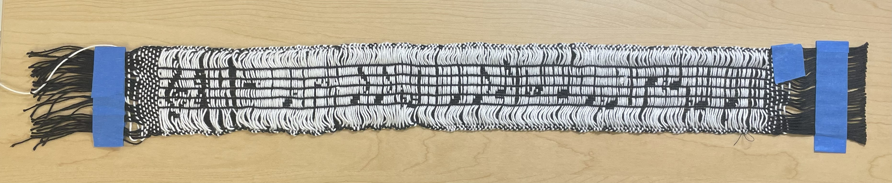
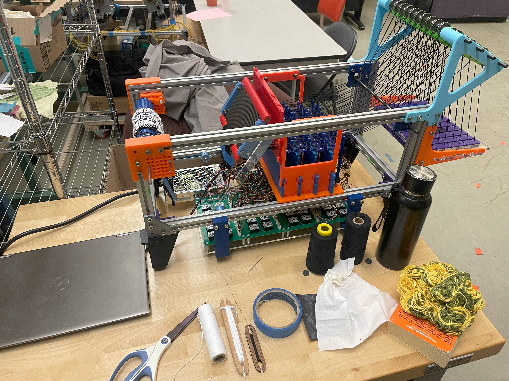

## Music Roboloom Project 4/27/2025, made for CMU class 15367 - Kevin

### Summary

---

For this project, I wanted to incorporate music into weaving. The goal is to write a program which takes in some notes and outputs a pixel art of the sheet music, as well as the line-by-line instructions for the roboloom. Overall, I was very satisfied with the combination of music and tech, and the resulting design was better than I thought.

First, about the program. The python program takes in a txt file containing the clef name (treble or bass) on the first line. Each line after the first represents one music note, specified by pitch and duration. It can also be a rest (with duration). The program takes this sequence of notes and groups them by a 4/4 time signature. If the note is too long, it splits it to the next measure and uses a tie to connect them. It also splits the note into 4 and 1 if the note is specifically 5 units long. If there are two sharps or flats of the same note in a measure, it also omits the second accidental as expected. Since the roboloom had only 40 warps, I had to design pixel art for the notes that was small enough to fit within these bounds, but also clear and distinct enough to tell what notes they are. The result is a sheet music image that is 40 pixels tall and however wide depending on the number of notes, and has black notes and stems on a white background. The underlying pixel values are then directly translated into roboloom instructions.
	
For the weaving, I used the hand-built roboloom with 40 warps, where the black thread is the warp and the white is the weft. In order to keep the pattern together, I also used an thin overshot black thread in the weft direction. The song I chose was "The World is Mine" by ryo. The weaving process in total took about 6 hours across different sessions. The main weaving process consists of inputting the next line of instruction into the motor, waiting for the motors to get into position, then tossing the shuttle across. Since there was also an overshot thread, there are two shuttles in total, and the order which I toss is first one across, second one across, first one back, and second one back. There was also many occasions where the motors get stuck, and I had to debug it, which took up a lot of time.

For the final output, there are some parts which could have turned out better, such as the vertical black lines for stems or bars being clearer. Also, there could be less spacing between the white weft threads. Overall, the pixel design translated very well into the final tapestry, and I don't think I could have come up for a better idea for the whole project idea and design output.

The roboloom itself was also built by me and another classmate in a previous project for the class. As part of the roboloom group, we built a weaving machine based on the parts given. I worked on this project with Justin over the course of a few office hours, and we were done building after a week and a half. Once the loom was done, I decided to create a simple pattern and tested out using two different weft colors.

Check out the Images folder for more details on the entire project.

### How to Use

---

- Open the directory.
- Input all the notes into the music_notes.txt file. The first line should specify treble or bass. All subsequent lines should have the note pitch followed by duration, or a rest followed by duration. See music_notes.txt for example.
- Run the musicgen.py file within the directory. This will generate an image of the sheet music as well as the instructions for roboloom.